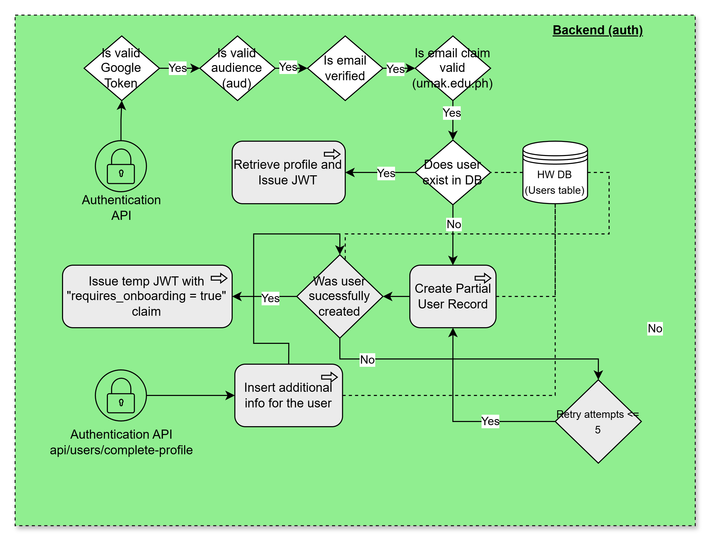

# Heron Wellnest Authentication API

A secure authentication and authorization microservice for the Heron Wellnest platform, providing JWT-based authentication for students, counselors, and administrators.

## 📋 Table of Contents

- [Features](#features)
- [Tech Stack](#tech-stack)
- [Architecture](#architecture)
- [Getting Started](#getting-started)
- [API Endpoints](#api-endpoints)
- [Environment Variables](#environment-variables)
- [Testing](#testing)
- [Deployment](#deployment)
- [Project Structure](#project-structure)

## ✨ Features

- **Multi-role Authentication**: Support for Students, Counselors, and Administrators
- **Google OAuth 2.0**: Secure authentication using institutional email (@umak.edu.ph)
- **JWT Token Management**: Access and refresh token generation with configurable TTL
- **Token Rotation**: Secure refresh token rotation to prevent token reuse
- **Role-based Access Control**: Different authentication flows for different user types
- **PostgreSQL Database**: Persistent storage with Supabase
- **Type Safety**: Full TypeScript implementation with Zod validation
- **Containerized**: Docker support for consistent deployments
- **CI/CD**: Automated testing and deployment with GitHub Actions

## 🛠 Tech Stack

- **Runtime**: Node.js 20
- **Language**: TypeScript
- **Framework**: Express.js
- **Database**: PostgreSQL (Supabase) | Google Cloud SQL
- **ORM**: TypeORM
- **Authentication**: 
  - Google OAuth 2.0
  - JWT (HS256 algorithm)
- **Validation**: Zod
- **Testing**: Jest
- **Linting**: ESLint
- **Containerization**: Docker
- **Cloud Platform**: Google Cloud Run
- **CI/CD**: GitHub Actions

## 🏗 Architecture

### Authentication Flow



*Figure: Authentication flow showing Google OAuth verification, JWT generation, and token storage*

### Token Types

- **Access Token**: Short-lived (15 minutes), used for API authorization
- **Refresh Token**: Long-lived (7 days), used to obtain new access tokens

## 🚀 Getting Started

### Prerequisites

- Node.js 20+
- Docker (optional)
- PostgreSQL database (or Supabase account)
- Google OAuth 2.0 credentials

### Installation

1. **Clone the repository**
   ```bash
   git clone <repository-url>
   cd authentication-api
   ```

2. **Install dependencies**
   ```bash
   npm install
   ```

3. **Set up environment variables**
   
   Create a `.env` file in the root directory:
   ```env
   NODE_ENV=development
   PORT=8080

   # Database
   DB_HOST=your-database-host
   DB_PORT=5432
   DB_USER=your-database-user
   DB_PASSWORD=your-database-password
   DB_NAME=postgres

   # Google OAuth
   GOOGLE_CLIENT_ID=your-google-client-id
   GOOGLE_EMAIL_DOMAIN=umak.edu.ph

   # JWT Configuration
   JWT_SECRET=your-secret-key-minimum-32-characters-long
   JWT_ALGORITHM=HS256
   JWT_ACCESS_TOKEN_TTL=15m
   JWT_REFRESH_TOKEN_TTL=7d
   JWT_ISSUER=heron-wellnest-auth-api
   JWT_AUDIENCE=heron-wellnest-user
   ```

4. **Run database migrations** (if applicable)
   ```bash
   npm run migration:run
   ```

5. **Start the development server**
   ```bash
   npm run dev
   ```

The API will be available at `http://localhost:8080`

### Docker Setup

1. **Build the image**
   ```bash
   docker build -t hw-auth-api .
   ```

2. **Run the container**
   ```bash
   docker run -p 8080:8080 --env-file .env hw-auth-api
   ```

## 📡 API Endpoints

### Health Check
- `GET /health` - Health check endpoint

### Authentication

#### Student Login
```http
POST /api/v1/auth/student/login
Content-Type: application/json

```

#### Admin Login
```http
POST /api/v1/auth/admin/login
Content-Type: application/json

{
  "admin_email": "admin@umak.edu.ph",
  "admin_password": "password"
}
```

#### Counselor Login
```http
POST /api/v1/auth/counselor/login
Content-Type: application/json

{
  "counselor_email": "counselor@umak.edu.ph",
  "counselor_password": "password"
}
```

#### Unified Login (Admin/Counselor)
```http
POST /api/v1/auth/login
Content-Type: application/json

{
  "email": "user@umak.edu.ph",
  "password": "password"
}
```

### Token Refresh

#### Refresh Student Token
```http
POST /api/v1/auth/student/refresh
Content-Type: application/json

{
  "user_id": "uuid",
  "refresh_token": "refresh-token"
}
```

#### Refresh Admin Token
```http
POST /api/v1/auth/admin/refresh
Content-Type: application/json

{
  "user_id": "uuid",
  "refresh_token": "refresh-token"
}
```

#### Refresh Counselor Token
```http
POST /api/v1/auth/counselor/refresh
Content-Type: application/json

{
  "user_id": "uuid",
  "refresh_token": "refresh-token"
}
```

### Response Format

Success Response:
```json
{
  "success": true,
  "data": {
    "access_token": "eyJhbGc...",
    "refresh_token": "eyJhbGc...",
    "token_type": "Bearer",
    "expires_in": 900
  },
  "message": "Login successful"
}
```

Error Response:
```json
{
  "success": false,
  "error": {
    "code": "INVALID_CREDENTIALS",
    "message": "Invalid email or password"
  }
}
```

## 🔧 Environment Variables

### Required Variables

| Variable | Description | Example |
|----------|-------------|---------|
| `NODE_ENV` | Application environment | `production` |
| `PORT` | Server port | `8080` |
| `DB_HOST` | Database host | `<region>.pooler.<cloud-provider>.com` |
| `DB_PORT` | Database port | `5432` |
| `DB_USER` | Database user | `<db-username>` |
| `DB_PASSWORD` | Database password | Stored in Google Secret Manager |
| `DB_NAME` | Database name | `postgres` |
| `GOOGLE_CLIENT_ID` | Google OAuth Client ID | Stored in Google Secret Manager |
| `GOOGLE_EMAIL_DOMAIN` | Allowed email domain | `umak.edu.ph` |
| `JWT_SECRET` | JWT signing secret | Stored in Google Secret Manager |
| `JWT_ALGORITHM` | JWT algorithm | `HS256` |
| `JWT_ACCESS_TOKEN_TTL` | Access token lifetime | `15m` |
| `JWT_REFRESH_TOKEN_TTL` | Refresh token lifetime | `7d` |
| `JWT_ISSUER` | JWT issuer | `heron-wellnest-auth-api` |
| `JWT_AUDIENCE` | JWT audience | `heron-wellnest-user` |

## 🧪 Testing

Run the test suite:

```bash
# Run all tests
npm test

# Run specific test file
npm test -- src/tests/auth.test.ts

# Run with coverage
npm run test:coverage
```

## 📦 Deployment

### GitHub Actions CI/CD

The project uses GitHub Actions for automated testing and deployment:

- **Staging Branch**: Runs linting and tests
- **Main Branch**: Runs tests, builds Docker image, and deploys to Google Cloud Run

### Manual Deployment to Google Cloud Run

1. **Authenticate with Google Cloud**
   ```bash
   gcloud auth login
   gcloud config set project <project-id>
   ```

2. **Build and push Docker image**
   ```bash
   docker build -t <region>-docker.pkg.dev/<project-id>/<artifact-registry-repo-name>/<service-name>:latest .
   docker push <region>-docker.pkg.dev/<project-id>/<artifact-registry-repo-name>/<service-name>:latest
   ```

3. **Deploy to Cloud Run**
   ```bash
   gcloud run deploy hw-auth-api \
     --image <region>-docker.pkg.dev/<project-id>/<artifact-registry-repo-name>/<service-name>:latest \
     --region <region> \
     --platform managed \
     --allow-unauthenticated \
     --set-secrets DB_PASSWORD=DB_PASSWORD:latest,GOOGLE_CLIENT_ID=GOOGLE_CLIENT_ID:latest,JWT_SECRET=JWT_SECRET:latest
   ```

### Cloud Run Configuration

- **Region**: us-central1
- **CPU**: 1 vCPU
- **Memory**: 512 MiB
- **Timeout**: 300 seconds
- **Concurrency**: 20 requests per instance
- **Min Instances**: 0
- **Max Instances**: 3
- **CPU Boost**: Enabled

## 📁 Project Structure

```
authentication-api/
├── src/
│   ├── config/
│   │   ├── database.config.ts      # Database connection configuration
│   │   └── env.config.ts           # Environment variable validation
│   ├── controllers/
│   │   ├── login.controller.ts     # Login request handlers
│   │   └── refresh.controller.ts   # Token refresh handlers
│   ├── entities/
│   │   ├── admin.entity.ts         # Admin entity
│   │   ├── counselor.entity.ts     # Counselor entity
│   │   ├── student.entity.ts       # Student entity
│   │   └── refresh-token entities  # Refresh token entities
│   ├── repositories/
│   │   ├── admin.repository.ts     # Admin data access
│   │   ├── counselor.repository.ts # Counselor data access
│   │   ├── student.repository.ts   # Student data access
│   │   └── refresh-token repos     # Token data access
│   ├── routes/
│   │   ├── auth.routes.ts          # Authentication routes
│   │   └── index.ts                # Route aggregator
│   ├── services/
│   │   ├── login.service.ts        # Login business logic
│   │   ├── refresh.service.ts      # Token refresh logic
│   │   └── google.service.ts       # Google OAuth verification
│   ├── types/
│   │   ├── appError.type.ts        # Custom error types
│   │   └── apiResponse.type.ts     # API response types
│   ├── utils/
│   │   └── jwt.util.ts             # JWT token utilities
│   ├── middlewares/
│   │   └── errorHandler.ts         # Global error handler
│   ├── tests/
│   │   └── auth.test.ts            # Authentication tests
│   └── app.ts                      # Express app setup
├── .github/
│   └── workflows/
│       └── workflow.yml            # CI/CD pipeline
├── .dockerignore
├── .env.example
├── .eslintrc.json
├── .gitignore
├── Dockerfile
├── package.json
├── tsconfig.json
└── README.md
```

## 👨‍💻 Development

### Code Style

The project uses ESLint for code linting:

```bash
# Run linter
npm run lint

# Fix auto-fixable issues
npm run lint:fix
```

### Database Migrations

```bash
# Generate migration
npm run migration:generate -- -n MigrationName

# Run migrations
npm run migration:run

# Revert migration
npm run migration:revert
```

## 📄 License

This project is proprietary software developed for Heron Wellnest platform.

## 👥 Authors

- **Arthur M. Artugue** - Lead Developer

## 🤝 Contributing

This is a private project. Please contact the project maintainers for contribution guidelines.

## 📞 Support

For issues and questions, please contact the development team.

---

**Last Updated**: October 28, 2025